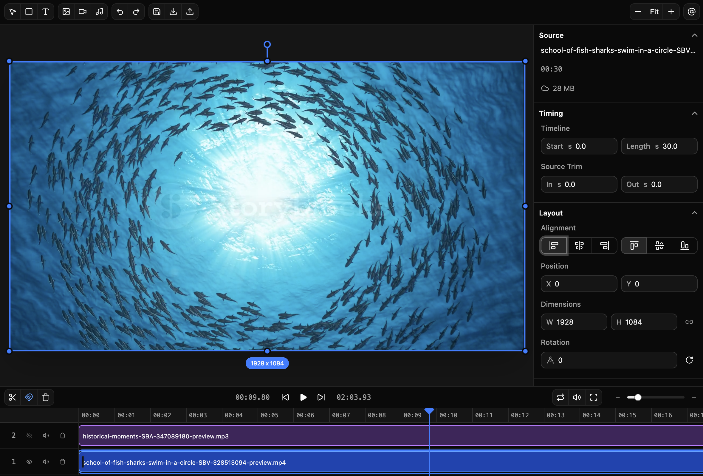

# Remotion Player DIY

A browser-based Remotion editor for arranging media and text clips, previewing the composition, and rendering finished videos.



The editor can be used locally without Vercel if you only want to build and preview content in the browser. Exporting/rendering videos is server-side because browser/client-side rendering has practical limits: long videos can be slow, memory-constrained, blocked by local `blob:` URLs, and unreliable across devices. This project's server-side render path is set up for Vercel using Vercel Blob and Vercel Sandbox.

## Documentation

Start with [docs/README.md](./docs/README.md) for app-level documentation:

- What the editor is and what users can do.
- How the toolbar, preview, inspector, transport, and timeline work.
- How the React and Remotion modules are organized.
- What the commit history says about how the app evolved.
- Which visible controls are placeholders today.

## Local Editing Only

Install dependencies and start the Vite dev server:

```bash
pnpm install
pnpm dev
```

This is enough to open the editor, import media, arrange clips, preview playback, and create content locally.

Without the Vercel render environment variables, source media uploads to Vercel Blob will fail in the background and the Render button will not be able to export a server-rendered video. Local editing still works from the browser's local object URLs.

## Server-Side Rendering on Vercel

Video rendering requires these Vercel resources:

- A Vercel project for the app.
- Vercel Blob storage connected to the project. It stores uploaded source media, rendered videos, and the Sandbox snapshot pointer.
- Vercel Sandbox compute available for the project. The render endpoint restores a Sandbox snapshot (a deps-only image — `node_modules` already installed) and renders the Remotion composition there.
- Vercel environment variables configured for Production, Preview, and Development as needed.

The render flow is:

1. The browser uploads imported media to Vercel Blob through `/api/upload`.
2. The browser calls `/api/render` with a shared-secret header.
3. `/api/render` restores a Vercel Sandbox snapshot if one exists for the current environment, otherwise creates a fresh sandbox. It then bundles the current Remotion project and pushes that bundle into the sandbox before rendering, so renders never run against stale code. The rendered video is uploaded to Vercel Blob.
4. Vercel Cron calls `/api/cleanup` daily to delete old Blob files.

### Sandbox snapshot lifecycle

Snapshot creation is decoupled from app deploys. Run `pnpm create-snapshot` manually when the deps image needs a refresh (e.g. lockfile changes, dependency upgrades).

- The snapshot contains only the installed `node_modules`. The Remotion bundle is pushed fresh on every render.
- The pointer is stored in Vercel Blob at `snapshot-cache/<VERCEL_ENV>.json` (`production`, `preview`, or `development`) as `{ snapshotId, createdAt }`. Run `pnpm create-snapshot` once per environment that should benefit from the warm start.
- New snapshots expire after 30 days. The script also deletes the previous snapshot via the `@vercel/sandbox` SDK so storage does not accumulate.
- If the pointer is missing or stale, `/api/render` logs a warning and falls back to a cold sandbox build — renders still succeed, just slower.

## Environment Variables

Create a local `.env.local` for development and add the same values in the Vercel project settings for deployed rendering:

```bash
RENDER_SHARED_SECRET=replace-with-a-long-random-secret
VITE_RENDER_SHARED_SECRET=replace-with-the-same-secret
BLOB_READ_WRITE_TOKEN=vercel_blob_rw_replace-with-your-token
CRON_SECRET=replace-with-a-different-long-random-secret
```

Do not commit real secrets. The two render shared-secret values must match because one is read by Vercel server functions and the other is embedded into the Vite browser bundle.

| Variable | Used by | Purpose |
| --- | --- | --- |
| `RENDER_SHARED_SECRET` | `/api/upload` and `/api/render` | Server-side expected value for the `x-render-secret` header. It prevents unauthenticated calls to the upload-token and render endpoints. |
| `VITE_RENDER_SHARED_SECRET` | Browser client | Client-side copy of the same shared secret. Vite only exposes env vars prefixed with `VITE_`, so the editor uses this value when calling `/api/upload` and `/api/render`. |
| `BLOB_READ_WRITE_TOKEN` | Server functions, snapshot script | Vercel Blob read/write token. Required to upload rendered videos, read/write Sandbox snapshot pointers, and clean up old Blob files. |
| `CRON_SECRET` | `/api/cleanup` | Bearer token required by the cleanup endpoint so only Vercel Cron, or someone with the secret, can delete old Blob objects. |

Because `VITE_RENDER_SHARED_SECRET` is shipped to the browser, treat this as a lightweight gate for your own deployment, not as strong protection for a public multi-user product. Add real authentication, authorization, rate limiting, and spend controls before making rendering broadly available.

## Vercel Deployment Notes

`package.json` defines a `vercel-build` script:

```bash
pnpm vercel-build
```

That script runs TypeScript and builds the Vite app. It does not create the Sandbox snapshot — snapshot creation is decoupled and run manually via `pnpm create-snapshot` when the deps image needs to be refreshed.

`vercel.json` configures:

- `/api/render` with a 300 second max duration for long renders.
- `/api/upload` for Vercel Blob client-upload token generation.
- `/api/cleanup` plus a daily cron schedule at `0 3 * * *`.

If `/api/render` logs `No sandbox snapshot pointer found at snapshot-cache/<env>.json`, run `pnpm create-snapshot` for that environment with `BLOB_READ_WRITE_TOKEN` set. Renders still work without a snapshot — they just fall back to cold sandbox builds.

## Useful Commands

```bash
pnpm dev              # Run the editor locally
pnpm build            # Type-check and build the Vite app
pnpm vercel-build     # TypeScript and Vite build (no snapshot step)
pnpm create-snapshot  # Refresh the Sandbox deps snapshot for the current environment
pnpm lint             # Run ESLint
pnpm remotion         # Open Remotion Studio
```

## Releases

Releases are automated from pushes to `main` with semantic-release.

Use Conventional Commits:

| Prefix | Version bump | Example |
| --- | --- | --- |
| `fix:` | patch | `fix: volume slider not persisting` |
| `feat:` | minor | `feat: add timeline scrubbing` |
| `feat!:` or `BREAKING CHANGE:` | major | `feat!: rename clip API` |
| `chore:`, `refactor:`, `docs:`, `test:`, `style:`, `ci:` | no release | `chore: bump deps` |
