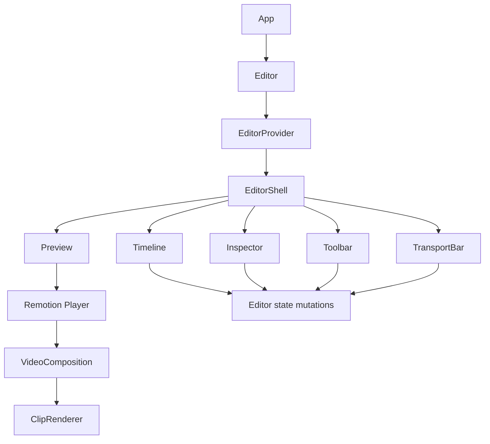

# Architecture

The app is a single React editor built around a shared editor context and a Remotion composition.

## Entry Points

- `src/App.tsx` renders `Editor`.
- `src/components/editor/editor.tsx` wraps the app in `EditorProvider` and `TooltipProvider`.
- `src/components/editor/shell/editor-shell.tsx` lays out the toolbar, preview, inspector, transport bar, and timeline.

## Editor State

State lives in `src/components/editor/model/editor-context.tsx` and is exposed through `src/components/editor/model/editor-context-value.ts`.

Core state includes:

- Canvas: `fps`, `width`, `height`.
- Playback: `currentFrame`, `isPlaying`, `isLooping`, `playerRef`, `fullscreenElementRef`, global preview `volume`.
- Editing: `clips`, `selectedClipId`.
- View: `timelineZoom`, `previewZoom`.
- Export: `quality`, `audioBitrateKbps`, `resolutionScale`.

Core mutations include:

- `addFiles`
- `addTextClip`
- `updateClip`
- `removeClip`
- `splitClip`
- `seekTo`
- `play`
- `pause`
- `togglePlay`
- timeline and preview zoom helpers

`EditorProvider` also registers the global Delete/Backspace shortcut for selected clip deletion. The handler ignores editable controls and modifier-key shortcuts so typing in inspector fields is not interrupted.

## Clip Creation

`src/components/editor/model/media-import.ts` converts dropped or selected files into imported media records. It determines type, creates a local object URL, and probes metadata.

`src/components/editor/model/clip-factory.ts` converts imported media into clips. It fits visual media within the canvas, stores imported file size metadata, assigns tracks by type, and appends new clips after existing clips in the same track.

Text clips are created in the same factory with default typography and a centered position.

`src/components/editor/model/clip-colors.ts` centralizes type-based editor colors. It maps clip types to the CSS token variables used by timeline bars, timeline selection rings, and canvas selection outlines.

## Composition Rendering

`src/components/editor/composition/video-composition.tsx` renders the editable composition inside Remotion. It uses:

- Remotion `Sequence` to place clips in time.
- `ClipRenderer` to render each clip type.
- `SelectionOutline` for editable outlines, resize handles, and rotation handles.
- dnd-kit for pointer dragging inside the canvas.

`src/components/editor/composition/clip-renderer.tsx` maps each `Clip` to Remotion primitives:

- `OffthreadVideo` for video.
- `Audio` for audio.
- `Img` for images.
- Plain HTML/CSS for text.

It applies transform, opacity, crop, border radius, trim, playback rate, volume, and fade behavior from the clip model.

`src/components/editor/composition/video-composition-render.tsx` is the non-interactive version for server rendering. It uses the same clip renderer without selection outlines or dnd-kit editing affordances.

## Preview

`src/components/editor/preview/preview.tsx` owns the visible preview surface. It measures available space with `ResizeObserver`, fits the configured canvas into the panel, then applies `previewZoom`.

The preview accepts drag-and-drop file imports and passes editor callbacks into the Remotion Player so the composition can update selection and clip layout. During drag-over it renders only a dashed editor-selection token border around the canvas.

The preview canvas element is also exposed through `fullscreenElementRef`. The transport fullscreen button requests fullscreen on that element and starts playback through the Remotion Player ref.

`src/components/editor/preview/preview-player-events.ts` keeps editor state in sync with Remotion Player playback events.

## Timeline

Timeline modules live in `src/components/editor/timeline/`.

- `timeline.tsx` coordinates seeking, dragging, resizing, track actions, playhead placement, and zoom math.
- `timeline-geometry.ts` contains frame/track geometry and patch helpers for trimming and dragging.
- `timeline-clip.tsx` renders clip bars, trim handles, and type-colored selected rings.
- `timeline-ruler.tsx` renders second ticks.
- `timeline-track.tsx` renders droppable rows.
- `timeline-track-header.tsx` renders per-track controls.

Timeline operations mutate the same `Clip` model used by the preview and inspector.

## Inspector

Inspector modules live in `src/components/editor/inspector/`.

- `inspector.tsx` selects between canvas-level controls and clip-level controls.
- `canvas-inspector.tsx` edits canvas dimensions, lists clips, and exposes export settings.
- `clip-inspector.tsx` edits media and text clip properties and displays imported source file size when available.
- `inspector-controls.tsx` contains local inspector helper controls such as sections, color inputs, and slider rows.

## Toolbar and Transport

Toolbar modules live in `src/components/editor/toolbar/`.

- `toolbar.tsx` handles import, text creation, render dialog opening, preview zoom, and project info.
- `render-dialog.tsx` displays server-render progress and result state.
- `project-info-button.tsx` shows project metadata and the GitHub link.

Transport modules live in `src/components/editor/transport/`.

- `transport-bar.tsx` handles split, delete, play/pause, seek start/end, loop, fullscreen playback, and timeline zoom.
- `transport-time.ts` formats frame positions for display.

## UI Conventions

Use existing primitives from `src/components/ui` before creating new editor controls. Current editor code uses shared controls such as `Button`, `ButtonGroup`, `Tooltip`, `InputGroup`, `Select`, `Slider`, `Accordion`, `ScrollArea`, `ToggleGroup`, and `Switch`.

Use semantic design-token classes for product UI. Avoid hardcoded palette utilities when token classes exist.

Editor-specific clip colors are CSS tokens in `src/index.css`: blue selection tokens for video/default selection, purple audio tokens, and teal image tokens. Prefer adding or reusing token mappings rather than hardcoded palette utilities.
